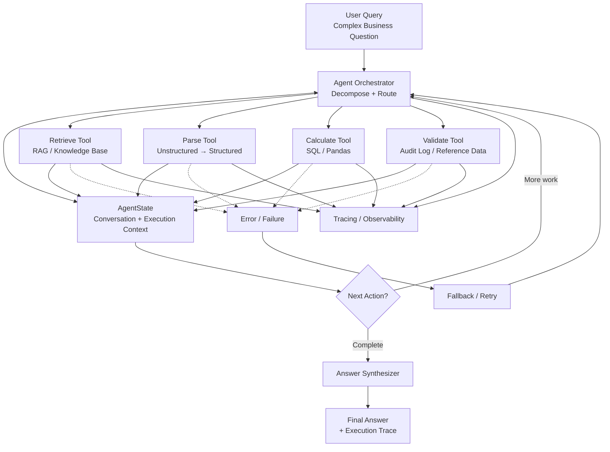

# Multi-Agent RAG Orchestration Framework

A production-oriented framework demonstrating **multi-step agentic reasoning over documents**, combining Retrieval-Augmented Generation (RAG), tool use, state management, validation, error handling, and LLM-driven routing.

The framework demonstrates how a complex business question can be decomposed into multiple execution steps rather than relying on a single **retrieve → generate** RAG call.

---

## What it demonstrates

A real-world workflow:

> **"Analyze Q1 financial data from our knowledge base, compute revenue per customer, and validate against the audit log."**

A question like this requires multiple capabilities:

1. **Retrieval** — search documents for relevant Q1 financial information
2. **Parsing** — extract structured metrics from unstructured documents
3. **Calculation** — compute business metrics such as revenue per customer
4. **Validation** — compare results against an audit log or reference dataset
5. **Response synthesis** — combine the results into a final answer
6. **Tracing** — preserve the execution history for debugging and observability

The important design principle is that each capability is implemented as a **composable tool**, while the orchestrator manages the overall workflow.

---

## Architecture

The framework follows an **agentic orchestration pattern** rather than a simple linear RAG pipeline.



### Execution flow

At a high level:

**User Query → Orchestrator → Tool Execution → State Update → Next Action → Synthesis → Final Answer**

The orchestrator can route execution based on the current state rather than assuming that every query follows exactly the same sequence.

For example:

```text
Retrieve
   ↓
Parse
   ↓
Calculate
   ↓
Validate
   ↓
Synthesize
```

But if validation requires additional information, the workflow can return to the orchestrator and perform another retrieval or calculation step.

This is the key difference between a **fixed pipeline** and an **agentic workflow**.

---

## Example workflow

For the question:

> "Analyze Q1 financial data, calculate revenue per customer, and validate it against the audit log."

The execution may look like:

```text
User Query
    │
    ▼
Orchestrator
    │
    ├──► Retrieve Q1 financial documents
    │
    ├──► Parse revenue and customer metrics
    │
    ├──► Calculate revenue per customer
    │
    ├──► Retrieve / query audit information
    │
    ├──► Validate calculated result
    │
    └──► Synthesize final answer
             │
             ▼
        Answer + Trace
```

Each step contributes information to the shared execution state.

---

## Key features

### State tracking

`AgentState` maintains the context required across multiple execution steps.

This allows later tools to consume outputs produced by earlier tools rather than treating every operation as an isolated request.

State can contain information such as:

- User query
- Current execution step
- Retrieved documents
- Parsed metrics
- Calculated results
- Validation results
- Tool outputs
- Execution metadata

---

### Tool registry

Tools are designed as independent, composable capabilities:

- **Retrieve** — retrieve relevant information from the knowledge base
- **Parse** — extract structured information
- **Calculate** — perform business calculations
- **Validate** — validate results against reference information

The orchestrator interacts with tools through their contracts rather than depending on their internal implementation.

In a production environment, individual tools could be backed by:

- Vector databases
- SQL engines
- APIs
- Python / Pandas
- LLM-based extraction
- Enterprise data platforms
- Audit or reference systems

---

### LLM-driven routing

In the demonstrated workflow, the orchestration pattern is explicit.

In a production implementation, an LLM or agent framework can determine:

> **"Given the current state, what should happen next?"**

For example:

```text
Current State
     │
     ▼
LLM / Router
     │
     ├── Retrieve
     ├── Parse
     ├── Calculate
     ├── Validate
     └── Finish
```

This allows the workflow to adapt to different business questions.

---

### Error handling

Tool failures should not necessarily terminate the entire workflow.

A production implementation can apply strategies such as:

```text
Tool Failure
     │
     ▼
Retry
     │
     ├── Success ──► Continue
     │
     └── Failure
           │
           ▼
       Fallback Tool
           │
           ├── Success ──► Continue
           │
           └── Failure
                 │
                 ▼
            Human Review
```

Possible production mechanisms include:

- Exponential backoff
- Retry policies
- Fallback tools
- Cached or pre-computed results
- Circuit breakers
- Human escalation
- Failure logging

---

### Full tracing

Each execution step can be traced with information such as:

- Step name
- Tool invoked
- Input
- Output
- Execution time
- Success / failure
- Error information

This is particularly important for agentic systems because debugging a multi-step workflow requires visibility into **what happened at each step**, not just the final answer.

Production implementations can integrate this information with observability and evaluation platforms such as Langfuse or LangSmith.

---

## Design insights

### Multi-agent reasoning vs. simple RAG

A traditional RAG workflow is typically:

```text
Query
  ↓
Retrieve
  ↓
LLM
  ↓
Answer
```

That works well for questions that can be answered directly from retrieved context.

Complex business questions often require several operations:

```text
Query
  ↓
Decompose
  ↓
Retrieve
  ↓
Parse
  ↓
Calculate
  ↓
Validate
  ↓
Synthesize
```

For example:

> "How are we trending?"

may require:

1. Retrieving historical data
2. Computing the change between periods
3. Comparing the result against an expectation
4. Validating the underlying data
5. Explaining the result

A single retrieval + generation call may not reliably perform all of these operations.

The orchestration pattern separates these responsibilities into explicit, testable steps.

---

## Tool composability

Each tool is independently replaceable.

For example:

| Capability | Prototype | Production possibilities |
|---|---|---|
| Retrieve | Simulated retrieval | pgvector, Pinecone, enterprise search |
| Parse | Python / extraction logic | LLM structured extraction |
| Calculate | Python / Pandas | SQL engine, data warehouse |
| Validate | Local reference data | Audit database / enterprise system |

The orchestrator does not need to change when the underlying implementation of a tool changes.

This separation makes the system easier to extend and integrate with enterprise systems.

---

## Why state matters

Without shared state, a multi-step agent would have to repeatedly reconstruct context.

With state:

```text
Step 1
  │
  ├── Retrieved documents
  │
  ▼
Step 2
  │
  ├── Parsed metrics
  │
  ▼
Step 3
  │
  ├── Calculated result
  │
  ▼
Step 4
  │
  ├── Validation result
  │
  ▼
Step 5
  │
  └── Final synthesis
```

`AgentState` provides the connective layer between these operations.

This is especially useful for long-running or multi-turn workflows.

---

## Error handling patterns

A production agentic system should assume that individual components can fail.

For example:

```text
Calculate Tool
      │
      ▼
   Failure?
    /    \
  Yes     No
   │       │
   ▼       ▼
 Retry   Continue
   │
   ▼
Still failing?
   │
   ▼
Fallback / Cached Result
   │
   ▼
Validation
   │
   ▼
Human Review if required
```

This allows the overall workflow to degrade gracefully rather than failing because of one tool invocation.

---

## Production deployment

The prototype demonstrates the **core orchestration pattern**.

A production deployment could add:

```text
                         ┌──────────────────────┐
                         │       User / API     │
                         └──────────┬───────────┘
                                    │
                                    ▼
                         ┌──────────────────────┐
                         │  Agent Orchestrator  │
                         │                      │
                         │ Routing + State      │
                         └──────────┬───────────┘
                                    │
                 ┌──────────────────┼──────────────────┐
                 │                  │                  │
                 ▼                  ▼                  ▼
          ┌─────────────┐    ┌─────────────┐    ┌─────────────┐
          │  Vector DB  │    │ SQL Engine  │    │  Audit Log  │
          │     RAG     │    │             │    │ / Reference │
          └─────────────┘    └─────────────┘    └─────────────┘
                 │                  │                  │
                 └──────────────────┼──────────────────┘
                                    ▼
                         ┌──────────────────────┐
                         │ Validation +         │
                         │ Answer Synthesis     │
                         └──────────┬───────────┘
                                    │
                                    ▼
                              Final Answer

        ┌─────────────────────────────────────────────────┐
        │       Observability / Evaluation                │
        │ Traces • Latency • Tool Success • LLM Quality  │
        └─────────────────────────────────────────────────┘
```

Production implementations could use frameworks such as **LangGraph or Mastra** for orchestration and integrate with:

- Vector databases
- SQL / data warehouse platforms
- Enterprise APIs
- Langfuse / LangSmith
- Monitoring systems
- Rate limiting
- Retry policies
- Circuit breakers
- Authentication and authorization

---

## Evaluation

Agentic systems should be evaluated at both the **workflow level** and the **individual tool / step level**.

Useful metrics include:

### Workflow metrics

- End-to-end success rate
- Final answer accuracy
- Task completion rate
- End-to-end latency

### Tool metrics

- Tool success rate
- Tool latency
- Retry frequency
- Failure rate
- Fallback frequency

### LLM metrics

- Routing accuracy
- Structured extraction accuracy
- Hallucination rate
- Token usage
- Cost per workflow

This is where an evaluation harness can become an important companion to the orchestration framework.

---

## Usage

Run the demonstration:

```bash
python3 multi_agent_rag.py
```

The demo executes a sample multi-step query and prints the execution trace, including:

- Tool calls
- Step outputs
- Validation results
- Execution information
- Final synthesized response

---

## Key implementation pointers

The core engineering principles demonstrated by this project are:

> **"I decompose complex business questions into explicit steps, with each step backed by a dedicated tool."**

> **"State is maintained across the workflow so each step can build on previous results."**

> **"Tools are composable, so the underlying implementation can change without redesigning the orchestrator."**

> **"Failures are treated as part of the workflow and can trigger retries, fallbacks, or escalation."**

> **"Every step should be observable and measurable because debugging an agentic system requires visibility into the complete execution path."**

---

## When this pattern is useful

The same orchestration architecture can support many enterprise use cases:

- Customer support
- Financial analysis
- Compliance checks
- Document intelligence
- Data analysis
- Research assistants
- Operations workflows
- Knowledge management
- Enterprise search
- Agentic analytics

The domain changes, but the underlying pattern remains:

```text
Business Question
       ↓
Decompose
       ↓
Route
       ↓
Execute Tools
       ↓
Maintain State
       ↓
Validate
       ↓
Synthesize
       ↓
Observable Result
```

---

## Interview talking points

This project demonstrates several concepts relevant to **Forward-Deployed Engineering and Agentic AI**:

- **Agent orchestration** — breaking complex business tasks into executable steps
- **RAG** — grounding responses in enterprise knowledge
- **Tool use** — connecting agents to deterministic capabilities
- **State management** — maintaining context across execution steps
- **Validation** — checking generated results against reference information
- **Resilience** — retries, fallbacks, and graceful failure handling
- **Observability** — tracing every step of the workflow
- **Evaluation** — measuring both individual steps and end-to-end outcomes
- **Enterprise integration** — replacing prototype tools with production data systems

### The core idea

> **Simple RAG retrieves information. Agentic RAG orchestrates actions to solve a business problem.**

